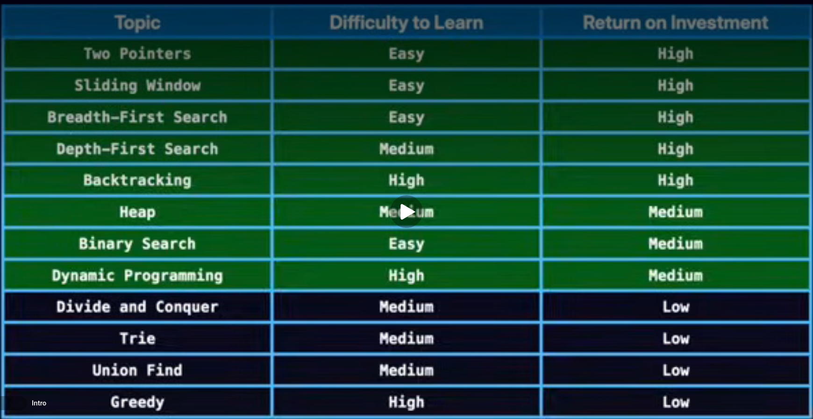

Linked List
    - Insertion
    - Deletion
    - Search (Iterative/Recursive)
    - Reverse the list
    - Detect the cycle (Floyd's Algorithm)

**Applications of priority queue**

1. Task Scheduling (Operating Systems) manages tasks by priority, executing high-priority tasks first in real-time systems.
2. Dijkstra's Shortest Path Algorithm uses a priority queue to find the shortest path by selecting the nearest node.
3. Huffman Encoding (Data Compression) combines least frequent symbols using a priority queue to reduce data size.
4. Merging Multiple Sorted Lists merges sorted lists by selecting the smallest element from each list.
5. A Search Algorithm (Pathfinding) prioritizes nodes based on cost to find the shortest path in navigation or games.

### Important Patterns:

- Two pointers
- Sliding window
- Binary search
- Breadth first
- Depth First
- Backtracking
- Dynamic programming
- Priority Queue

